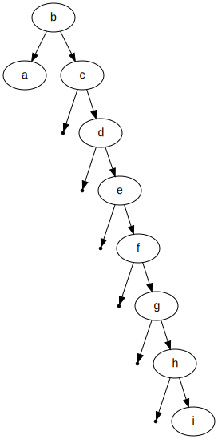

# ex 1

Gegeben sei folgende Liste von Elementen, die in einen binären Suchbaum eingetragen werden sollen: { a , b , c , d , e , f , g , h , i }
Zeichnen Sie den binären Suchbaum, falls diese Elementliste

## ex (a)

wie oben sortiert ist

digraph BST {
    node [fontname="Arial"];
    null0 [shape=point];
    "a" -> null0;
    "a" -> "b";
    null1 [shape=point];
    "b" -> null1;
    "b" -> "c";
    null2 [shape=point];
    "c" -> null2;
    "c" -> "d"
    null3 [shape=point];
    "d" -> null3;
    "d" -> "e"
    null4 [shape=point];
    "e" -> null4;
    "e" -> "f"
    null5 [shape=point];
    "f" -> null5;
    "f" -> "g"
    null6 [shape=point];
    "g" -> null6
    "g" -> "h"
    null7 [shape=point];
    "h" -> null7
    "h" -> "i"
    null8 [shape=point];
    null9 [shape=point];
    "i" -> null8
    "i" -> null9
}

## ex (b)

wie ändert sich der binäre Suchbaum, falls zyklisch rotiert wird
( { b , c , d , e , f , g , h , i , a } ... )

In discrete mathematics, tree rotation is an operation on a binary tree that changes the structure without interfering with the order of the elements. A tree rotation moves one node up in the tree and one node down.

digraph BST {
    node [fontname="Arial"];
    "b" -> "a";
    "b" -> "c";
    null2 [shape=point];
    "c" -> null2;
    "c" -> "d"
    null3 [shape=point];
    "d" -> null3;
    "d" -> "e"
    null4 [shape=point];
    "e" -> null4;
    "e" -> "f"
    null5 [shape=point];
    "f" -> null5;
    "f" -> "g"
    null6 [shape=point];
    "g" -> null6
    "g" -> "h"
    null7 [shape=point];
    "h" -> null7
    "h" -> "i"
}

## ex (c)

umgekehrt sortiert ist:

digraph BST {
    node [fontname="Arial"];
    "i" -> "h";
    null0 [shape=point];
    "i" -> null0;
    "h" -> "g";
    null1 [shape=point];
    "h" -> null1;
    "g" -> "f"
    null2 [shape=point];
    "g" -> null2;
    "f" -> "e"
    null3 [shape=point];
    "f" -> null3;
    "e" -> "d"
    null4 [shape=point];
    "e" -> null4;
    "d" -> "c"
    null5 [shape=point];
    "d" -> null5;
    "c" -> "b"
    null6 [shape=point];
    "c" -> null6
    "b" -> "a"
    null7 [shape=point];
    "b" -> null7
    null8 [shape=point];
    null9 [shape=point];
    "a" -> null8
    "a" -> null9
}

## ex(d)

folgendermassensortiertist:{a,i,b,h,c,g,d,f,e}

digraph BST {
    node [fontname="Arial"];
    null0 [shape=point];
    "a" -> null0
    "a" -> "i"
    "i" -> "b"
    null1 [shape=point];
    "i" -> null1
    null2 [shape=point];
    "b" -> null2
    "b" -> "h"
    "h" -> "c"
    null3 [shape=point];
    "h" -> null3
    null4 [shape=point];
    "c" -> null4
    "c" -> "g"
    "g" -> "d"
    null5 [shape=point];
    "g" -> null5
    null6 [shape=point];
    "d" -> null6
    "d" -> "f"
    "f" -> "e"
    null7 [shape=point];
    "f" -> null7
    null8 [shape=point];
    "e" -> null8
    null9 [shape=point];
    "e" -> null9
}

## ex(e)

Mit welcher Reihenfolge erhält man einen möglichst ausgeglichenen Baum?
Hinweis: Es gibt mehrere korrekte Lösungen.

gleichmässig aufgeteilt, beginnend in der mitte.

# 2

Eine Menge von n Zahlen kann sortiert werden, indem man diese zuerst in einen
binären Suchbaum einfügt (sukzessive Anwendung von TREE-INSERT) und dann durch INORDER-TREE-WALK in sortierter Reihenfolge wieder ausgeben lässt. Bestimmen Sie die Worst-Case und Best-Case Laufzeiten für diesen Sortieralgorithmus.

## sol

Inorder traversal of BST prints it in ascending order. The only trick is to modify recursion termination condition in standard Inorder Tree Traversal.

def printSorted(arr, start, end): 
    if start > end:  
        return
      
    printSorted(arr, start * 2 + 1, end) 
      
    print(arr[start], end = " ")  
      
    printSorted(arr, start * 2 + 2, end) 
  
if __name__ == '__main__': 
    arr = [4, 2, 5, 1, 3]  
    arr_size = len(arr)  
    printSorted(arr, 0, arr_size - 1)

Best Case: O(log n)
Worst Casse: O(n log n)
